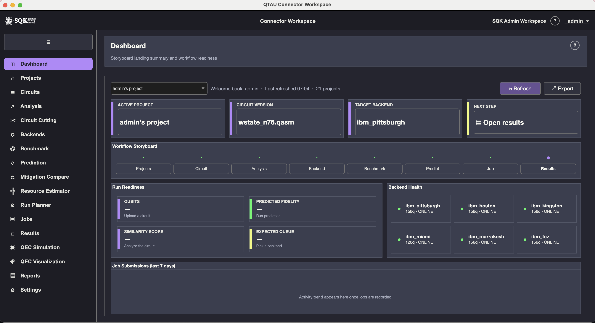
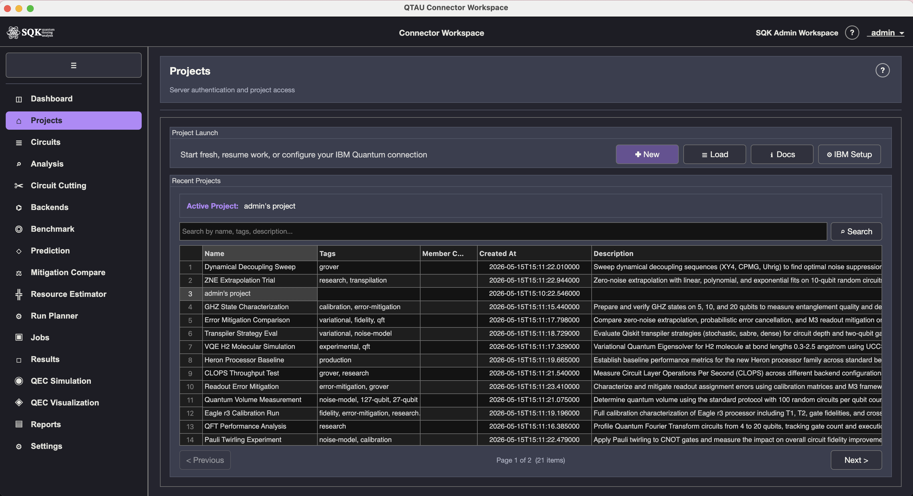
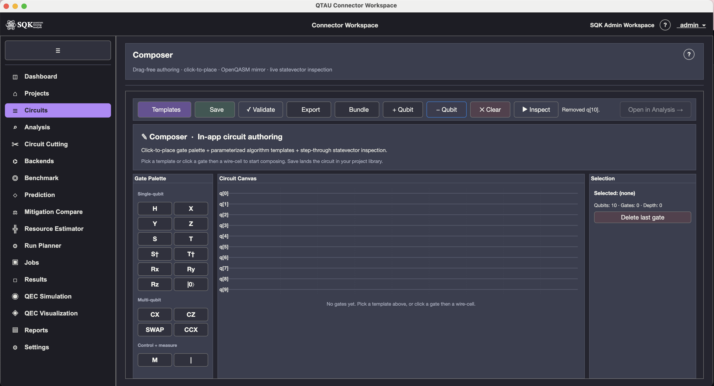
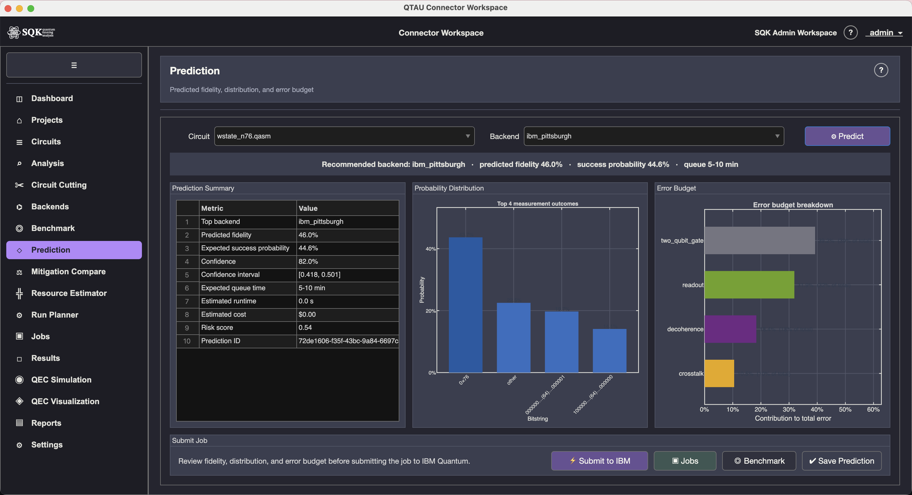
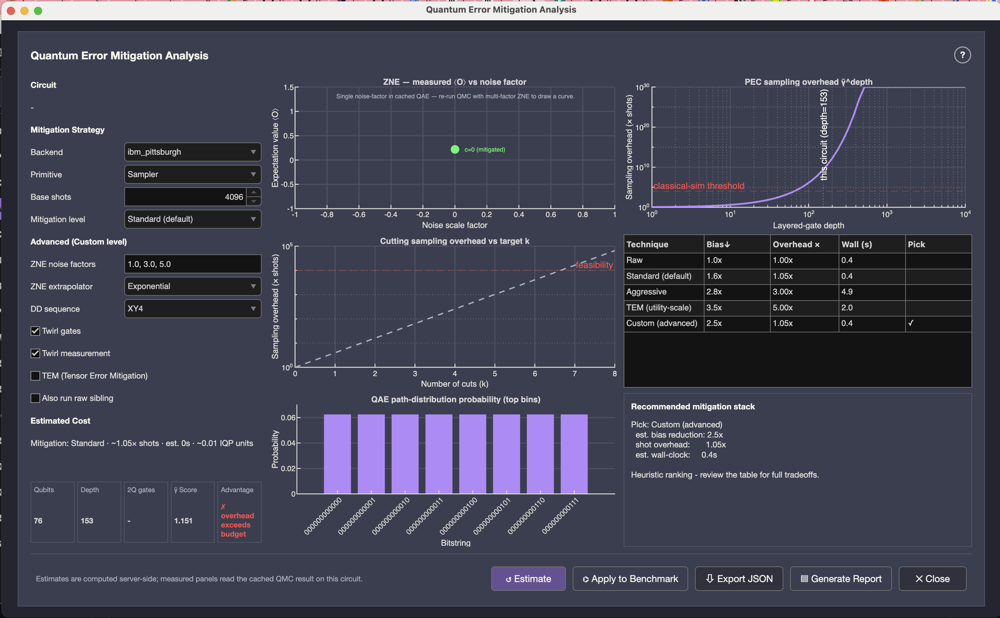
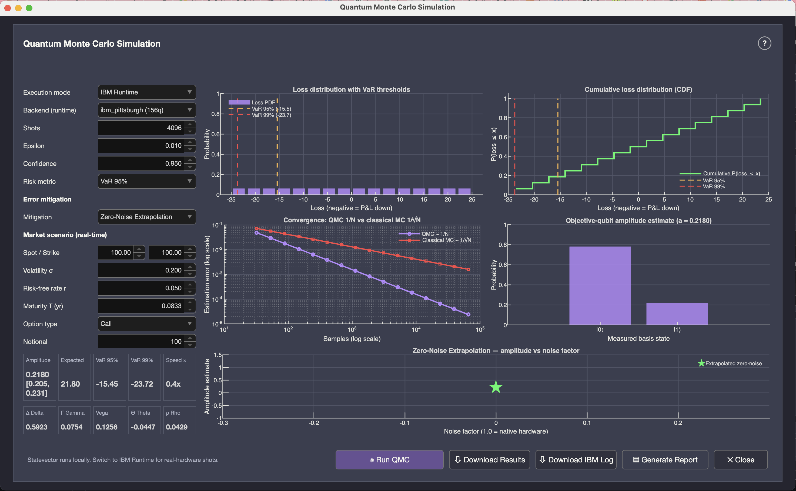
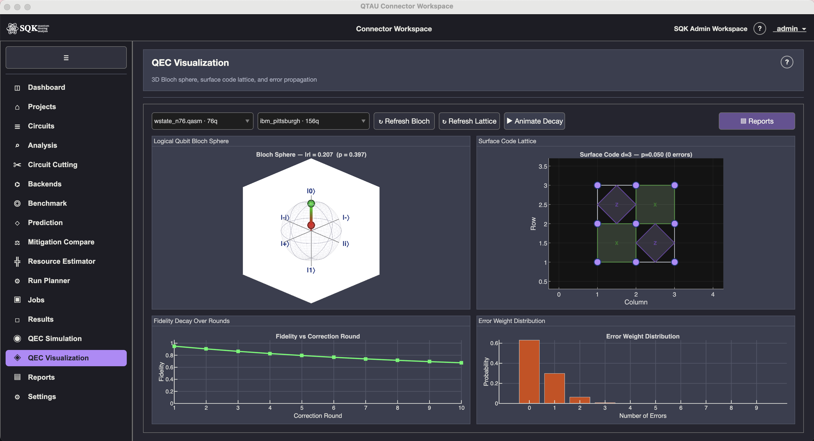

# QTAU Connector Workbench



> A professional **MATLAB R2025b+** desktop client for designing, running, mitigating, and analysing quantum-circuit experiments against IBM Quantum hardware through the QTAU FastAPI backend.

**MATLAB Central File Exchange:** [183914 — QTAU Connector Workbench](https://www.mathworks.com/matlabcentral/fileexchange/183914-qtau-connector-workbench)
**Source code:** <https://github.com/sqkcloud/sqk-qtau-matlab>
**License:** Apache 2.0 (Copyright © 2026 SQK Cloud Inc) — see [LICENSE](LICENSE) and [NOTICE](NOTICE)

The toolbox is the *client only* — your data lives on whichever QTAU server you connect to. It is built on a clean three-layer architecture (presentation / domain / infrastructure), externalised configuration (`resources/*.properties`, runtime-reloadable), structured `Logger` output, and unit-tested service classes that you can drive both interactively from the workbench UI and programmatically from your own MATLAB scripts.

---

## What's new in **1.1.0** (2026-05-20)

- **MATLAB Help browser integration.** `info.xml` + `doc/help/helptoc.xml` + 4 HTML pages + `demos.xml`. The toolbox now appears as a first-class entry in F1 search; the *Examples* tab in the Add-On Explorer hosts three runnable scripts.
- **Three pre-rendered example scripts** under `doc/examples/` — local QEC simulation, circuit visualisation, and programmatic FastAPI browsing. Two run offline with no backend.
- **Notes screen** restored to the sidebar between Circuits and Analysis.
- **QEC 3-qubit bit-flip decoder fix** — inverse-encoding circuit now applied before the partial trace, so the `bitflip3` / `repetition` / `phaseflip3` codes correctly handle superposition logical inputs (`|+⟩`, `|-⟩`, …). Previously fidelity capped at 0.5 even under a noiseless channel.

See [CHANGELOG.md](CHANGELOG.md) for the full 1.0.0 → 1.1.0 diff.

---

## Install from a `.mltbx`

1. **Install MATLAB R2025b or later.**
2. Download `QTAUConnectorWorkbench.mltbx` from the [File Exchange listing](https://www.mathworks.com/matlabcentral/fileexchange/183914-qtau-connector-workbench) and **double-click it inside MATLAB**. MATLAB registers the toolbox and adds it to the path.
3. From the MATLAB prompt, type:
   ```matlab
   QTAUWorkbenchLauncher
   ```
4. The Login dialog appears. **On first launch the Base URL is blank — set it to your QTAU server URL** (e.g. `https://qtau.example.com:5715` or `http://localhost:5715` if you self-host).
5. Enter your username + password and sign in.

The **Getting Started** guide is registered with the install and accessible via *Add-Ons → Manage Add-Ons → QTAU Connector Workbench → Options → Getting Started*. The same content is also reachable inside the workbench via *Help → Documentation* once 1.1.0 is installed.

> The toolbox does **not** ship the FastAPI backend. You need either access to a hosted QTAU server (ask your admin) or a self-hosted instance. The backend is a separate open-source project — see the [GitHub repository](https://github.com/sqkcloud/sqk-qtau-matlab) for setup notes.

---

## A guided tour

### 1. Pick a project after login



The workbench launches into the **Dashboard** by default; from there the **Projects** entry on the sidebar (formerly "Welcome" — routing key preserved for back-compat) lets you switch between organisational projects, see recent activity, and create new workspaces. Each project keeps its own circuits, jobs, benchmarks, predictions, mitigation runs, reports, and operator notes — fully isolated.

### 2. Compose circuits visually (or by code)



The **Composer** screen ships a 12-template gallery (Bell, GHZ_n, QFT_n, Grover_k, Bernstein-Vazirani_n, Deutsch-Jozsa_n, Phase Estimation, VQE H₂, QAOA, Trotter, Teleport, Superdense), a full single- and multi-qubit gate palette (`H/X/Y/Z/S/T/S†/T†/Rx/Ry/Rz/reset/CX/CZ/SWAP/CCX/M/barrier`), and a bidirectional **OpenQASM 2.0 mirror** — type code, see the canvas; drag on the canvas, see the code. A collapsible **Inspect** footer runs a local statevector simulator (≤ 14 qubits) with per-qubit Bloch sphere tiles and top-K amplitude bars.

**Multi-target code export** writes the same circuit out as OpenQASM 2/3, Qiskit Python, Cirq Python, or AWS Braket Python with one click. The **Reproducibility Bundle** packages QASM + all three Python equivalents + circuit metadata + an optional backend calibration snapshot + optional mitigation estimates + an FT resource estimate + an auto-generated README + a `manifest.json` with SHA-256 checksums of every artefact, zipped for sharing — a Tier-3 differentiator no other quantum vendor ships today.

### 3. Predict fidelity before you spend any quantum credits



Pick a circuit + backend and the **Prediction** screen returns predicted fidelity, success-probability distribution, expected queue time, runtime, and an error budget broken down by physical source. The same numbers feed the Run Planner's Pareto frontier so you can see the cost-vs-fidelity trade-off across every available chip + mitigation level.

### 4. Compare error-mitigation strategies side-by-side



The **Mitigation Compare** screen is a pre-submit strategy planner that runs `POST /api/mitigation/estimate` in parallel across every chip in your selection. Cost, shot-multiplier, runtime, and IQP-cost cards line up so you can pick *None / Minimal / Standard / Aggressive / Custom* deliberately. A colour-graded shot-multiplier ranking bar chart and a recommendation strip (cheapest / best balance / most aggressive) make the decision concrete. No competitor (IBM / AWS Braket / Azure Quantum / Google / Quantinuum / IonQ / Rigetti) ships an analogous side-by-side mitigation cost comparator.

### 5. Run quantum Monte Carlo analytics from inside MATLAB



A modal Quantum Monte Carlo dialog launched from the Analysis toolbar runs QAE-based Monte Carlo risk analytics against either a local statevector backend or IBM Runtime. Async job dispatch (`POST /api/circuits/{id}/qae/analyze` → `202 {job_id}`) is polled by a 3-second MATLAB `timer` until completion; the loading overlay walks the user through `Queued (0 %) → Running (50 %) → Completed (100 %)` without blocking the UI. **Zero-noise extrapolation** is on by default. The **Generate Report** button produces a vector-chart PDF (loss distribution with VaR, CDF, QAE-vs-classical-MC convergence curve, amplitude bar, ZNE curve, Greeks table, market scenario, benchmark matches). The **Download IBM Log** button streams `GET /api/circuits/{id}/qae/ibm-log?fmt=jsonl` — one record per IBM submission matching the canonical schema in `samples/aqs-qmc/`.

### 6. Visualise quantum error correction in 3D



The **QEC Visualization** screen renders a 3D Bloch sphere, the surface-code lattice, and an error-propagation animation. The companion **QEC Simulation** screen sweeps fidelity vs. noise probability for six codes (`bitflip3 / phaseflip3 / shor9 / steane7 / perfect5 / surface`) against four noise models (`bitflip / phaseflip / depolarizing / amplitude_damping`) — all running locally in pure MATLAB, no backend required. The 1.1.0 release also fixes a fidelity-ceiling bug in the bit-flip code's decoder; superposition logical inputs (`|+⟩`, `|-⟩`, etc.) now decode to fidelity 1.0 under a noiseless channel as they should.

### 7. Find the cheapest configuration that meets your fidelity target

The **Run Planner** screen dispatches one `PredictionService.predict` call (per-backend base fidelity) plus *N* parallel `MitigationService.estimate` calls (per-strategy cost), cross-multiplies them into M·N candidate configurations, applies a heuristic mitigation-fidelity factor (None ×1.0 → Aggressive ×1.30, capped 0.99), computes the Pareto frontier via `RunPlannerService.computeParetoFrontier`, and recommends the cheapest configuration that hits your target via `RunPlannerService.pickOptimal`. Falls back to highest-fidelity-overall when no config meets the target. Renders a Pareto scatter (all points + frontier overlay + target line + optimal-star) and a recommendation card with **Submit-this-run** + **Bundle-this-config** hand-off buttons. The cost-aware "give me fidelity F at minimum spend" question is the question every quantum operations team is asking today — and no other platform in the 7-vendor audit answers it in one click.

---

## Feature catalog

### Authoring & design
- **In-app Composer** with click-to-place gate palette, uiaxes canvas, bidirectional OpenQASM mirror, and a 12-template gallery (Bell, GHZ_n, QFT_n, Grover_k, Bernstein-Vazirani_n, Deutsch-Jozsa_n, Phase Estimation, VQE H₂, QAOA, Trotter, Teleport, Superdense).
- **Local statevector simulator** (≤ 14 qubits) in the collapsible *Inspect* footer — per-qubit Bloch ⟨X⟩/⟨Y⟩/⟨Z⟩ tiles, top-K amplitude bars, ▶ Auto-step.
- **Multi-target export**: OpenQASM 2/3, Qiskit Python, Cirq Python, AWS Braket Python — copy-to-clipboard + save-to-file.
- **Reproducibility Bundle** (📦 Bundle): one-click ZIP packaging circuit + 3 Python ecosystems + circuit metadata + optional calibration snapshot + optional mitigation estimates + optional FT resource estimate + README + `manifest.json` with SHA-256 checksums.

### Execution planning
- **Backends** explorer with per-qubit calibration heat-grid, 7-day sparkline history (T1, T2, 2Q error), and force-directed coupling-map topology view.
- **Prediction** screen — predicted fidelity, success-probability distribution, error budget per physical-error source, expected queue time, runtime.
- **Mitigation Compare** — cost/shot-multiplier/runtime/IQP-cost cards for None / Minimal / Standard / Aggressive / Custom strategies, side-by-side across chips. Tier-3 differentiator.
- **Resource Estimator** — fault-tolerant overhead planner. Computes surface-code distance (Fowler et al.), physical-per-logical qubit count, T-state budget, T-factory footprint, and total runtime.
- **Run Planner** — cost-aware Pareto optimiser: cheapest backend × mitigation × shots configuration that meets a target fidelity. Tier-3 differentiator.

### Execution & monitoring
- **Jobs Dashboard** with 6-column live table (Job ID / Circuit / Backend / Status / Progress / Created), 5-second auto-refresh while visible, right-click context menus, detailed job logs.
- **Results** screen comparing measured vs. predicted vs. ideal outcome distributions for any completed job.
- **Reports** — vector-chart PDF generation, HTML export, sharing.
- **Background Tasks** tray — drop-down list of in-flight async operations with cancel / view-progress actions.

### Quantum error correction
- **QEC Simulation** — density-matrix simulator for 6 codes (`bitflip3 / phaseflip3 / shor9 / steane7 / perfect5 / surface`) under 4 noise models; per-qubit error rate sourced from backend calibration when available.
- **QEC Visualization** — 3D Bloch sphere, surface-code lattice rendering, error-propagation animation.

### Quantum Monte Carlo (financial / actuarial workloads)
- **QMC popup** launched from the Analysis screen — async IBM Runtime job execution with 3-second poll loop, zero-noise extrapolation, vector-chart PDF report builder, IBM execution-log JSONL download matching the upstream `JSONLLogger` schema.

### Integration & extensibility
- **`scripts/seed_*.m`** — 14 idempotent seed scripts populating demo projects, circuits, benchmarks, jobs, reports.
- **`doc/examples/`** — three runnable Live Scripts (QEC sim, circuit visualisation, programmatic API browse).
- **MATLAB Help integration** — F1 search returns workbench pages; *Examples* tab lists the runnable scripts.
- **OpenAPI contract** — `doc/openapi.json` (the full FastAPI backend spec) ships with the repo so you can validate against the deployed server.

---

## Architecture in 30 seconds

```
src/
├── presentation/     UI chrome, navigation, screens, viewmodels
│   ├── app/          QTAUWorkbenchApp + NavigationManager + LayoutBuilder
│   ├── screens/      21 screen-builder functions (pure UI)
│   └── viewmodels/   21 ViewModel classes (callbacks, state)
├── domain/           Pure business logic, no UI dependencies
│   ├── models/       AppState (session-scoped mutable state)
│   └── services/     11 service classes (Auth / Backend / Circuit / Job / …)
└── infrastructure/   HTTP, config, logging
    ├── http/         FastAPIClient (matlab.net.http multipart upload)
    └── config/       AppConfig, Labels, Logger, JsonHelper, CircuitDiagram, Theme
```

**Data flow:** Screen → ViewModel → Service → FastAPIClient → HTTP. Services receive `FastAPIClient` via constructor injection (`ServiceContainer`); `AppState` is instantiated once and shared across ViewModels for the session.

The same Service classes power the workbench UI and the [`doc/examples/example_03_connect_and_browse.m`](doc/examples/example_03_connect_and_browse.m) standalone script — anything you can do interactively, you can do from a `.m` file.

---

## For developers — work directly from source

### Option 1 — Open via Project Manager (recommended)

1. In MATLAB, go to **Home > Open > Open Project**
2. Select `sqk-qtau-matlab.prj`
3. MATLAB configures the path and launches the app automatically

Or from the Command Window:

```matlab
matlab.project.openProject('sqk-qtau-matlab.prj')
```

### Option 2 — Single command (no project file needed)

```matlab
cd('/path/to/sqk-qtau-matlab')
run('QTAUWorkbenchLauncher.m')
```

`QTAUWorkbenchLauncher.m` sets up the MATLAB search path and starts the app in one step.

---

## Configuration

All runtime settings live in `resources/` — no source-code edits needed.

| File | Purpose |
|---|---|
| `resources/app.properties` | API endpoint, timeout, app metadata, QEC defaults |
| `resources/labels.properties` | All UI text strings (1000+) |
| `resources/seed.properties` | Seed-script credentials (copy from `.example` — gitignored) |

**The shipped toolbox uses an empty `base_url`** so end-users are forced to pick a server on first launch via the Login dialog. For local development you can override this locally without committing the change:

```properties
# resources/app.properties (local override — do not commit)
base_url=http://localhost:5715
login_path=/api/auth/login
http_timeout=30
```

When `base_url` is blank, `AppState` falls back to `http://localhost:5715`.

### Login returns HTTP 401

A **401 Unauthorized** response means the server rejected the request: wrong username/password, account missing, or account disabled. Confirm credentials with whoever administers the QTAU API, or check the server logs.

---

## Architecture

Three-layer clean architecture under `src/`:

```
src/
├── presentation/          ← UI layer
│   ├── app/               ← Main app class, layout, navigation, overlays (centralized nav-click loading overlay)
│   ├── screens/           ← 17 screen builder functions (Notes hidden from sidebar, easily re-enabled)
│   ├── viewmodels/        ← 17 ViewModel classes (callbacks, poll timers, async flows)
│   └── DialogBuilder.m    ← Modal dialog factory — hosts the Quantum Monte Carlo popup
├── domain/                ← Business logic layer
│   ├── models/            ← Session-scoped state (AppState)
│   ├── services/          ← 12 service classes (includes QmcService for async QMC jobs + IBM-log download, CuttingService for batch lifecycle)
│   └── ServiceContainer.m ← Dependency injection container
└── infrastructure/        ← Technical foundation
    ├── http/              ← HTTP gateway (FastAPIClient) — optional per-call timeout, authenticated download helper
    ├── config/            ← Static utilities (AppConfig, Labels, Logger, JsonHelper, Theme, CircuitDiagram)
    └── AsyncRunner.m      ← Async execution wrapper
```

**Data flow:** Screen → ViewModel → Service → FastAPIClient → HTTP

- **Screens** are functions that build UI into a provided container. They return no object.
- **ViewModels** are classes that own callbacks; they call services and update UI.
- **Services** receive `FastAPIClient` via constructor (dependency injection). They have no UI dependencies.
- **AppState** is instantiated once by `QTAUWorkbenchApp` and shared across ViewModels for the session lifetime.
- **Static utilities** (`AppConfig`, `Labels`, `Logger`, `JsonHelper`) use static methods with cached state; call `.reload()` to refresh.

---

## Project Structure

```
sqk-qtau-matlab/
├── QTAUWorkbenchLauncher.m           ← Single-command launcher (path setup + start app)
├── sqk-qtau-matlab.prj               ← MATLAB Project Manager file
├── README.md
├── CLAUDE.md
│
├── src/
│   ├── presentation/
│   │   ├── app/
│   │   │   ├── QTAUWorkbenchApp.m    ← Main app class (UI chrome, navigation, service wiring)
│   │   │   ├── LayoutBuilder.m       ← UI layout utilities
│   │   │   ├── NavigationManager.m   ← Screen switching logic
│   │   │   ├── OverlayManager.m      ← Overlay/modal management
│   │   │   ├── PopupMenuManager.m    ← Context menu management
│   │   │   └── StyleHelper.m         ← UI styling utilities
│   │   ├── screens/                  ← 17 screen builder functions
│   │   │   ├── WelcomeScreen.m
│   │   │   ├── DashboardScreen.m
│   │   │   ├── CircuitsScreen.m
│   │   │   ├── NotesScreen.m
│   │   │   ├── UploadScreen.m
│   │   │   ├── AnalysisScreen.m
│   │   │   ├── DetailedAnalysisScreen.m
│   │   │   ├── BackendsScreen.m
│   │   │   ├── BenchmarkScreen.m
│   │   │   ├── BenchmarkDashboardScreen.m
│   │   │   ├── PredictionScreen.m
│   │   │   ├── JobsScreen.m
│   │   │   ├── ResultsScreen.m
│   │   │   ├── ReportsScreen.m
│   │   │   ├── SettingsScreen.m
│   │   │   ├── QecSimulationScreen.m
│   │   │   └── QecVisualizationScreen.m
│   │   ├── viewmodels/               ← 17 ViewModel classes
│   │   │   ├── WelcomeViewModel.m
│   │   │   ├── DashboardViewModel.m
│   │   │   ├── CircuitsViewModel.m
│   │   │   ├── NotesViewModel.m
│   │   │   ├── UploadViewModel.m
│   │   │   ├── AnalysisViewModel.m
│   │   │   ├── DetailedAnalysisViewModel.m
│   │   │   ├── BackendsViewModel.m
│   │   │   ├── BenchmarkViewModel.m
│   │   │   ├── BenchmarkDashboardViewModel.m
│   │   │   ├── PredictionViewModel.m
│   │   │   ├── JobsViewModel.m
│   │   │   ├── ResultsViewModel.m
│   │   │   ├── ReportsViewModel.m
│   │   │   ├── SettingsViewModel.m
│   │   │   ├── QecSimulationViewModel.m
│   │   │   └── QecVisualizationViewModel.m
│   │   └── DialogBuilder.m           ← Dialog creation utilities
│   │
│   ├── domain/
│   │   ├── ServiceContainer.m        ← Dependency injection container
│   │   ├── models/
│   │   │   └── AppState.m            ← Session-scoped mutable state
│   │   └── services/                 ← 11 service classes
│   │       ├── AuthService.m
│   │       ├── BackendService.m
│   │       ├── BenchmarkService.m
│   │       ├── CircuitService.m
│   │       ├── JobService.m
│   │       ├── PredictionService.m
│   │       ├── ProjectService.m
│   │       ├── QaeService.m          ← Async QAE/QMC — submitAnalyze / getAnalyzeJob / cancel / downloadIbmLog
│   │       ├── QecEngineService.m
│   │       ├── ReportService.m
│   │       └── SettingsService.m
│   │
│   └── infrastructure/
│       ├── AsyncRunner.m             ← Async execution wrapper
│       ├── http/
│       │   └── FastAPIClient.m       ← HTTP gateway (webread/webwrite, Bearer auth, multipart)
│       └── config/
│           ├── AppConfig.m           ← Reads app.properties
│           ├── Labels.m              ← Reads labels.properties (600+ UI strings)
│           ├── Logger.m              ← Structured logger
│           ├── JsonHelper.m          ← JSON decode / table mapping
│           ├── CircuitDiagram.m      ← Circuit visualization and rendering
│           └── Theme.m               ← UI color and styling constants
│
├── resources/                        ← Externalized configuration
│   ├── app.properties                ← API endpoint, timeout, QEC defaults
│   ├── labels.properties             ← 600+ UI text strings
│   ├── seed.properties               ← Seed credentials (git-ignored)
│   ├── seed.properties.example       ← Seed credentials template
│   └── sqk-logo-*.svg               ← Application logo
│
├── doc/                             ← API documentation
│   ├── fastapi_contract.md           ← Endpoint contract with request/response examples
│   └── openapi.json                  ← OpenAPI 3.0 specification
│
├── scripts/                          ← Seed and utility scripts
│   ├── launch.m                      ← Launcher if CWD is scripts/
│   ├── seed_all.m                    ← Master orchestrator (runs all seed scripts)
│   ├── seed_helpers.m                ← Shared auth and HTTP utilities
│   ├── seed_projects.m              ← Seed 20 demo projects
│   ├── seed_circuits.m              ← Seed 10 sample OpenQASM circuits
│   ├── seed_qasmbench.m             ← Seed 113+ QTAUBench benchmark circuits
│   ├── seed_qasmbench_invalid.m     ← Re-upload previously invalid QTAUBench circuits
│   ├── seed_backends.m              ← Seed backend selections
│   ├── seed_benchmarks.m            ← Seed benchmark configurations
│   ├── seed_predictions.m           ← Seed fidelity predictions
│   ├── seed_jobs.m                  ← Seed job submissions
│   ├── seed_reports.m               ← Seed generated reports
│   ├── seed_notes.m                 ← Seed markdown notes
│   └── seed_settings.m             ← Seed user preferences
│
├── samples/                          ← OpenQASM circuit files
│   ├── *.qasm                        ← 12 hand-crafted sample circuits
│   └── qasmbench/                    ← QTAUBench benchmark suite (252 circuits)
│       ├── small/                    ← 2-10 qubits (85 files)
│       ├── medium/                   ← 11-27 qubits (47 files)
│       └── large/                    ← 28+ qubits (120 files)
│
├── tests/                            ← 20 unit test files
│   ├── StubFastAPIClient.m          ← Mock HTTP client for testing
│   ├── test_AppConfig.m
│   ├── test_AppState.m
│   ├── test_AsyncRunner.m
│   ├── test_AuthService.m
│   ├── test_BackendService.m
│   ├── test_BenchmarkService.m
│   ├── test_CircuitService.m
│   ├── test_FastAPIClient.m
│   ├── test_JobService.m
│   ├── test_JsonHelper.m
│   ├── test_Labels.m
│   ├── test_Logger.m
│   ├── test_PredictionService.m
│   ├── test_ProjectService.m
│   ├── test_QecEngineService.m
│   ├── test_ReportService.m
│   ├── test_ServiceContainer.m
│   ├── test_SettingsService.m
│   └── test_Theme.m
│
└── output/                           ← Generated logs, plots, reports (git-ignored)
```

---

## Key Features

- **17-screen workflow UI** — Welcome, Dashboard, Circuits, Notes (hidden), Upload, Analysis, Detailed Analysis, Backends, Benchmark, Benchmark Dashboard, Prediction, Jobs, Results, Reports, Settings, QEC Simulation, QEC Visualization
- **Quantum Monte Carlo simulation** — Modal popup launched from Analysis with async IBM-Runtime execution (submit → poll → render), zero-noise extrapolation, greeks, loss distribution, and one-click PDF + IBM execution-log download
- **Async job pattern (QAE)** — `POST /qae/analyze` returns `202 {job_id}` immediately; MATLAB timer polls `GET /qae/jobs/{id}` every 3 s with live status / progress in the overlay
- **Download IBM Log** — Streams the Qiskit Runtime execution record as JSONL matching the hybrid-QMC reference schema (`{subcircuit_id, backend, shots, status, job_id, counts, error}`)
- **Jobs Monitoring Dashboard** — 6-column table (Job ID / Circuit / Backend / Status / Progress / Created) sorted newest-first, with **5-second silent auto-refresh** that self-terminates on navigation away
- **Detailed Analysis** — Circuit selector + Analyze bridge button that routes back to the Analysis screen with the picked circuit pre-selected and auto-analyzes
- **Centralized nav-click loading overlay** — `Loading {Screen}…` on every screen that triggers async data loading, with a 20 s safety timer backstop
- **Google-inspired login dialog** — Professional sign-in card with externalized labels
- **Project context tracking** — Selected project persists across all screens via AppState
- **Circuit management** — Browse, upload, analyze, preview SVG diagrams, match against benchmarks
- **QEC simulation engine** — Surface code simulation with configurable noise models and 3D visualization
- **QTAUBench integration** — 252 benchmark circuits (small/medium/large) — DB migration script `migrate_rename_bench_sources.py` on the backend rewrites legacy `QASMBench` / `MQTBench` source labels
- **Chart-rich PDF reports** — Dedicated QMC PDF builder with native ReportLab vector charts (loss distribution with VaR lines, CDF, QAE vs classical MC convergence, amplitude, ZNE curve, Greeks table)
- **Externalized text** — 600+ UI strings in `labels.properties` (change text without editing code)
- **Structured logging** — `[HH:MM:SS.FFF] LEVEL [Category] Message` format via `Logger`
- **Dependency injection** — Services wired via `ServiceContainer` with `FastAPIClient` injection
- **Comprehensive seed scripts** — 14 scripts to populate the backend with demo data

---

## Running Tests

```matlab
% Run the full suite (31 test files)
runtests('tests')

% Run a single test file
runtests('tests/test_AppConfig')
```

Tests use `StubFastAPIClient.m` as a mock HTTP client for isolated unit testing.

---

## Seeding Demo Data

```matlab
% Seed all screens at once
run('scripts/seed_all.m')

% Or seed individual screens
run('scripts/seed_projects.m')
run('scripts/seed_circuits.m')
run('scripts/seed_qasmbench.m')
```

Requires `resources/seed.properties` with `seed_username` and `seed_password`. Copy from `seed.properties.example`.

---

## FastAPI Backend Endpoints

The client communicates with the FastAPI backend across **~80 endpoints** organized into 10 categories:

| Category | Key Endpoints | Methods |
|---|---|---|
| **Auth** | `/api/auth/login`, `/api/auth/me`, `/api/auth/logout` | POST, GET |
| **Projects** | `/api/projects`, `/api/projects/{id}/dashboard`, `.../notes`, `.../benchmark-config` | GET, POST, PATCH, DELETE |
| **Circuits** | `/api/circuits`, `/api/circuits/upload/file`, `.../{id}/analyze`, `.../{id}/preview` | GET, POST, PATCH, DELETE |
| **Backends** | `/api/backends`, `.../{name}/calibration`, `.../{name}/topology`, `.../compare` | GET, POST |
| **Benchmarks** | `/api/benchmark/volumetric`, `.../scorecard`, `.../regression`, `.../classify/{id}` | GET |
| **Predictions** | `/api/predict`, `/api/optimize` | POST, GET |
| **Jobs** | `/api/projects/{id}/jobs` (sorted `submitted_at` desc), `/api/jobs/{id}/status`, `.../results`, `.../cancel` | GET, POST |
| **QAE / QMC** | `POST /api/circuits/{id}/qae/analyze` (async, returns 202 + job_id), `GET /api/qae/jobs/{id}` (poll), `DELETE /api/qae/jobs/{id}` (cancel), `GET /api/circuits/{id}/qae/result` (cached), `GET /api/circuits/{id}/qae/ibm-log?fmt=jsonl` (exec-log download) | GET, POST, DELETE |
| **Reports** | `/api/reports/generate` (dedicated QMC builder when `qae` data is present), `.../{id}/download`, `.../{id}/share` | GET, POST |
| **Settings** | `/api/settings`, `/api/settings/preferences`, `/api/settings/verify-ibm` | GET, POST, DELETE |

Full contract with request/response examples: [`doc/fastapi_contract.md`](doc/fastapi_contract.md)

### Further reading

- [`doc/architecture.md`](doc/architecture.md) — layering, data flow (where Results come from), caching, navigation internals, uihtml pitfalls.
- [`doc/development_guide.md`](doc/development_guide.md) — recipes for adding / changing screens, services, dialogs, timers; testing patterns; things to avoid.
- [`doc/fastapi_contract.md`](doc/fastapi_contract.md) — REST endpoint contract.

---

## Naming Conventions

| Element | Convention | Example |
|---|---|---|
| Classes | PascalCase | `AppState`, `FastAPIClient` |
| Methods / properties | camelCase | `onLogin`, `authToken` |
| Config / label keys | snake_case | `base_url`, `nav_welcome` |
| Screen files | PascalCase + `Screen` | `WelcomeScreen.m` |
| ViewModel files | PascalCase + `ViewModel` | `WelcomeViewModel.m` |
| Service files | PascalCase + `Service` | `CircuitService.m` |

---

## Packaging as a Toolbox (`.mltbx`)

> **For the full publishing runbook (90 min step-by-step including File Exchange submission), see [`PUBLISHING.md`](PUBLISHING.md).** The section below is a fast checklist.

This repo is source code. To build a distributable `QTAUConnectorWorkbench.mltbx` (for MathWorks File Exchange or direct distribution):

### Prerequisites
- MATLAB **R2025b or later**.
- The repo opens cleanly via `sqk-qtau-matlab.prj`.
- `LICENSE` + `NOTICE` files at repo root (Apache 2.0, © SQK Cloud Inc, with PNNL QASMBench attribution).
- `doc/GettingStarted.m` converted to `doc/GettingStarted.mlx` (open it in MATLAB Live Editor and save as `.mlx`).
- A toolbox image — render a 64×64 (or 256×256) PNG from `resources/sqk-logo-kokkos-white1-reordered.svg` and place at e.g. `resources/toolbox-icon.png`.

### Steps

> **First refresh the `.prj` file.** The committed `sqk-qtau-matlab.prj` is R2025b schema but its `<ProjectFile>` list points at pre-refactor paths (`src/QTAUWorkbenchApp.m`, `src/tabs/*Tab.m`, etc.) — just stale metadata. To refresh: in MATLAB, **File → Close Project**, delete `sqk-qtau-matlab.prj` on disk, then **Home → New → Project → From Folder** pointed at the repo root. MATLAB scans the folder and writes a fresh `.prj` listing the current files.

1. **Open the project** in MATLAB R2025b+:
   ```matlab
   matlab.project.openProject('sqk-qtau-matlab.prj')
   ```
2. From the **Project** toolstrip, click **Package Toolbox**. MATLAB creates a toolbox task in the project.
3. **Toolbox Folder**: the project root (everything is gated by the Exclusions list below).
4. **Toolbox Information**:
   - Name: `QTAU Connector Workbench`
   - Version: `1.0.0.0` (`major.minor.bug.build`)
   - Author / Email / Company: SQK Cloud Inc + maintainer email
   - Toolbox image: `resources/toolbox-icon.png`
   - Summary: *MATLAB desktop client for managing IBM Quantum experiments through the QTAU FastAPI backend.*
   - Description: copy from the top of this README.
5. **Exclusions** — paste this into the *Edit Exclusions* dialog:
   ```
   .git
   .github
   .gitignore
   .gitattributes
   .claude
   .serena
   .DS_Store
   resources/seed.properties
   EmAnalysis_*.json
   Report_*.pdf
   ExecLog_*.jsonl
   Results_*.json
   Reconstruction_*.json
   output
   scripts
   tests
   doc/keys.txt
   *.mex*
   *.token
   .env
   release
   *.mltbx
   CLAUDE.md
   ```
   Notes: `scripts/` is excluded as a whole (the seed scripts reference `seed_helpers.m`, so partial exclusion would break the rest); `tests/` excluded because end-users rarely run unit tests and the StubFastAPIClient is a dev-only helper; `output/` excluded because it's a runtime scratch directory; `CLAUDE.md` excluded because it's a developer-oriented AI-pair-programming guide, not end-user documentation.

6. **Toolbox Requirements** — let MATLAB auto-detect. *Required Add-Ons* should be empty (this app uses base MATLAB only); *Discovered Requirements* should not list anything outside the toolbox folder. Click **View Analysis** to confirm.

7. **Install Actions**:
   - **MATLAB Path**: add **the repo root** (so `QTAUWorkbenchLauncher.m` is callable at the prompt) **plus the 10 source folders** that the launcher itself adds:
     ```
     <toolbox root>
     <toolbox root>/src/presentation
     <toolbox root>/src/presentation/app
     <toolbox root>/src/presentation/screens
     <toolbox root>/src/presentation/viewmodels
     <toolbox root>/src/domain
     <toolbox root>/src/domain/models
     <toolbox root>/src/domain/services
     <toolbox root>/src/infrastructure
     <toolbox root>/src/infrastructure/http
     <toolbox root>/src/infrastructure/config
     ```
     This matches exactly what `QTAUWorkbenchLauncher.m` does at runtime (lines 48-59) and makes the install-time addpath idempotent with the launcher's. Do NOT add `tests/`, `scripts/`, `resources/`, `samples/`, `doc/`, `doc/`, or `output/` — those are accessed via relative paths from the code, not via MATLAB Path lookup.
   - **Java Classpath**: empty.
   - **Apps**: empty (no `.mlapp` files in the repo).
   - **Getting Started Guide**: `doc/GettingStarted.mlx` (convert from `doc/GettingStarted.m` first — see prerequisites above).
8. **Toolbox Portability**:
   - Supported Platforms: Windows, macOS, Linux, MATLAB Online.
   - Release Compatibility: R2025b or later.
9. **Output Settings**: leave default (`release/QTAUConnectorWorkbench.mltbx`).
10. Click **Reanalyze** → **Package Toolbox**. The `.mltbx` lands in the `release/` folder (gitignored).

### Test on a clean machine
Before distribution, install the `.mltbx` on a fresh MATLAB instance:
1. Double-click `QTAUConnectorWorkbench.mltbx` — MATLAB registers it.
2. Run `QTAUWorkbenchLauncher` at the prompt — Login dialog should appear with an empty Base URL.
3. Set Base URL to a known QTAU server, log in, smoke-test Dashboard → Circuits → Analysis.
4. Open the Getting Started guide via *Add-Ons → your toolbox → Options → Getting Started* — it should render.
5. Uninstall via *Add-Ons → Manage Add-Ons → Uninstall* — verify clean removal.

### Publishing on MATLAB Central File Exchange
- **Allowed**: data files, images, `.m`/`.mlx`. Pure MATLAB code is welcome.
- **Not allowed**: MEX, DLL, ActiveX controls (per the MathWorks "Create and Share Toolboxes" doc). This toolbox is pure MATLAB so the restriction doesn't apply.
- File Exchange accepts Apache 2.0 with an explicit attribution in the submission form.
